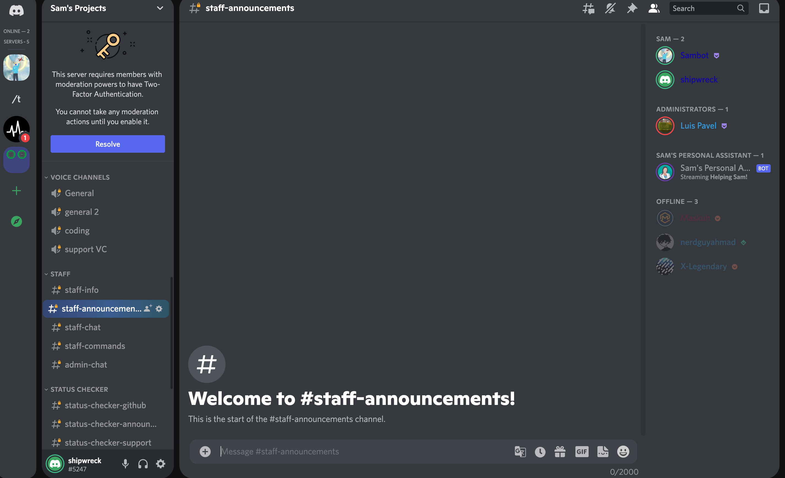
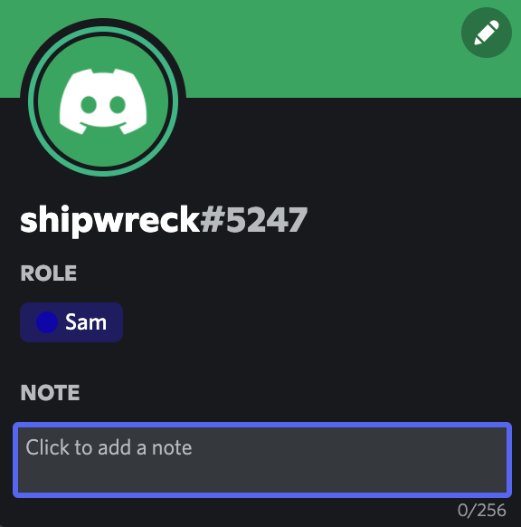
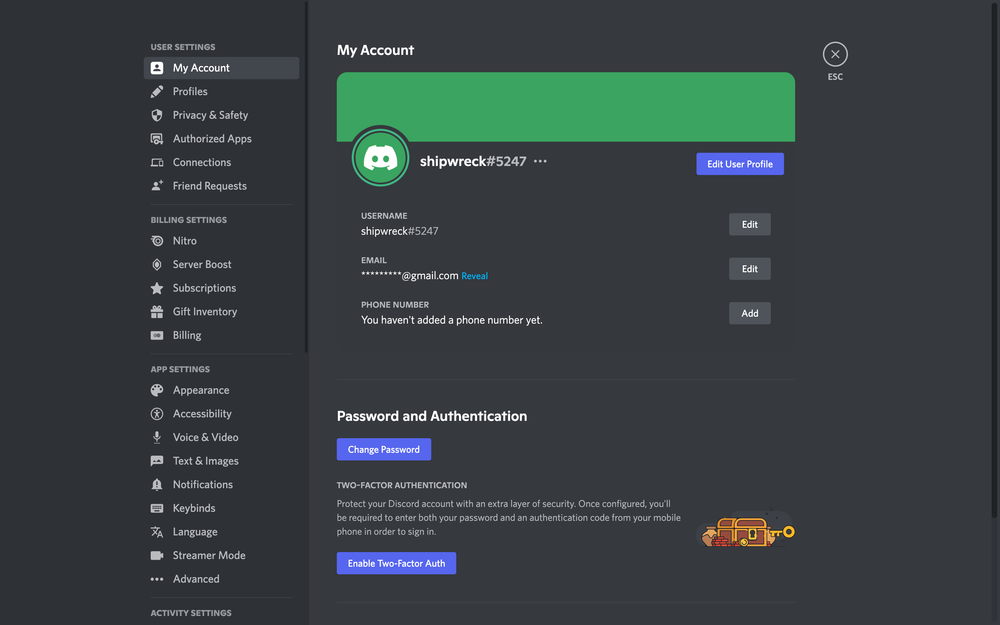

# AnActuallyDecentTheme
An actually decent discord theme that get's rid of all that stupid background crap and makes everything more round

# Installation instructions (BetterDiscord)

<li> Download the theme.css file
<li> Move it to your themes folder
<li> enable it

